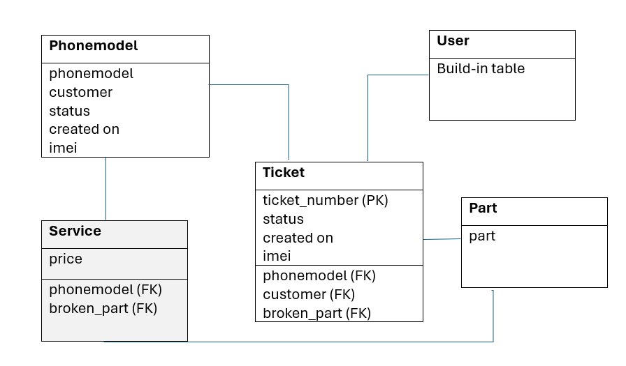

# Smart Tech Repair

## Project Description
Smart Tech Repair is a small business specialized in repairs of phones, laptops, tablets, gaming, (smwart)watches and much more. The company aims to deliver fast and reliable service to its customers. The customers can either do an online booking or walk-in to the store during the opening hours. 

### Current process (ist)
Customers lookup for information on the business profile of the company on Google and give a call to Smart Tech. On the phone they request for information. The technician needs to find out the price (as these drop and go up quickly) and the availibility of the part and often has to keep the customer waiting over the phone or give a call back after finding out the information. 

### New process (soll)
Customer leave its details and the a descripion of the issue behind. The technician prepares for this and contact the customer. The ticket status is updated to keep the customer up-do-date and has a history of tickets that were created before.

### Scope
During this project the focus will be on the device type: phones. As these categories are the most common onces with the most repairing requests. Furthermore, the aim to solve the following issues:
1. Make the process easier so that the technician has information in advance and is fully prepared when contacting the customer
2. Create an application that the customer can create a ticket with the issue for the device.
3. check the history of repairs with Smart Tech so that for any requests in the future the technician can give a personalized service.
4. Option to login and check the status as the user

## The model

### Data model
The models consists of five classes. I havent used the class service for this project, but left it in the project for future enhancements.

### The classes

#### Phonemodel
For storing the phones by manufacturer and series. Made this unique by adding slug

|Key|Name|Type|Extra info|
|---|----|----|----------|
|manufacturer|Charfield|Choices|
|series|Charfield||
|slug|slugfield||Unique - combination of manufacturer and series|

#### Part
For saving the parts.

|Key|Name|Type|Extra info|
|---|----|----|----------|
||part|Charfield|choices|

#### Service
Each phone has a different price for the part. Therefore, I created this table. Innitialy, I used the table Part for the price. During the process I recognized that I had created a more to more relation. Due to time constraints I didnt use this table and I left it in for future enhancements.

|Key|Name|Type|Extra info|
|---|----|----|----------|
|Foreign Key|Phonemodel|Phonemodel||
|Foreign Key|Broken_part|Part||
||Price|DecimalField|2 places decimal|

#### Ticket

|Key|Name|Type|Extra info|
|---|----|----|----------|
|Primary Key|ticket_number|Charfield|Unique|
|Foreign Key|phonemodel|Phonemodel||
|Foreign Key|customer|User||
|Foreign Key|broken_part| Part||
||status|Integerfield|Choices - default = pending|
||imei|Charfield||

#### User

This is the build in table of Django. I used this for authentication purposes. 

## Agile 

### Project phases
|Phase|Start date|End date|Description|
|-----|----------|--------|-----------|
|0|10/12|14/12|Project preparation|
|1|15/12|19/12|Create front end with Bootstrap|
|2|19/12|24/12|Create Read ticket|
|3|24/12|29/01|Update Delete ticket|
|4|29/12|03/01|Testing and finalise|

#### sprint 0 Project Planning
In this sprint I prepared myself for the project by setting up the environment, database and doing an initial deployment to Heroku (just to make sure that connections are working fine). I created my first main app, which is the book_repair. And I created the model as well as creating the product backlog items. I planned a meeting with my mentor to discuss my project. The following changes I decided to make:

Make the scope of the project smaller by:
1. Building the application for the device type phones only. Initially, I wanted to go with the categories laptops, tablets and phones. Looking at the time constraints I decided to focus on the functionality rather than different types of devices. 
2. For the brands, I chose to go with the two biggest ones Apple and Samsung (In Samsung specifically for the s-series). As these are the ones with the highest number of requests.
3. Dropping the invoice functionality. Adding this to the future enhancements. For now I want to focus only on the booking system with the CRUD functionality. 

Other considerations

Different services take different amount of times. However, for this project, I will consider each service to have a duration of one hour.

#### sprint 1 Create Front-end with Bootstrap

At first, I was planning to use a Bootstrap template and edit the template to make my own. However, to learn more about Bootstrap and make this a fully custom project, I decided to start from blank and bring my ideas to the front. When I started with this I saw myself using css. Later in the process I discovered that Bootstrap has more to offer and I can actually make use of that. I learnt the margins and paddings in Bootstrap. Also, copied the grid at places(in the homepage and the book repair page) from the Bootstrap library. This was very easy to use as it gave me the flexibility through all screen sizes.

#### sprint 2 Create ticket

This was the the most complicated phase for me as Django consists of multiple files and sometimes I had to look which bit to place where. In this phase I created the ticket form to save new information to the database. I made use of the course content, but realised that I was doing something wrong. I was trying to combine three forms in one which was causing lots of issues. I was able to solve the issues, but I knew that going forwards with this would not be the best solution. 

I combined three forms:
1. I created a table for customer instead of using the user table. Which would mean that the customer has to fill every time its personal details when creating a ticket. This was one part of the form.
2. I used the part from the Part table instead of using the foreign key from the Ticket table in the form
3. The ticket form (which I would only need to use)

And the biggest issue with this setup was that the logged in user could create multiple customers and access the customers. Also, I realised that the User table is very powerfull and I should be using that. 

Because of the issues above I was not able to finish the sprint goal within the time frame. As I was not fully sure how to solve these issues I kept the PBI for creating a new customer on hold. Because of this reason I had a overlap with sprint 3. 

#### sprint 3 Update and delete

This sprint had a overlap with the previous one. In this sprint I changed model. Managed to retrieve the data and update and delete. Some major blockers for me in this sprint were:

1. Removing the Customer table and using the User table instead. As I had mulptiple relations with the Customer table this was giving me errors. I made the mistake of first removing the customer and then trying to replace. This broke my application and I was not able to understand where things were not going right. I then uncomitted the changes. First I changed all the places the data is used by the customer data. When I was sure that there was no link left I was able to delete the Customer with no errors.
2. I added a ticket number for all requests.
3. I added a slugfield for a user-friendly url. This caused the issue of empty fields in the database as I already had added the the phonemodels and the series. I started with allowing Null values. Then I wrote a shell script to push the data to the database for all phonemodels. 

At the end of this sprint I have some pending tasks open: Redirecting to correct pages.

#### sprint 4 Testing and finalising

This sprint I started with the pending work left from the previous sprint, namely the redirecting messages. This went well. What I would do different next time is to implement them directly and close it. This would save me some time in going back and rethinking where to put the piece of code. 

I have been testing throughout the project, but in this phase some bigger changes needed to be made:
- From my testing, I discovered that it was possible to register without entering the password. This was working before, but perhaps by changing the authentication to custom something broke. I spoke to the tutor support team and they suggested me not to play around with these setting and keeping the authentication as it is in Django. As this was a bit of a last minute thing. I decided to revert to the Authentication method of Django and add a email field in the request itself. For the future I would like to use ALLAUTH method to make the email mandatory.

- There was a horizontal scroll bar appearing. This was because the footer was going of frame. I made the changes so that everything fits nicely on the screen.

- I was not fully happy with my navigation. I decided to reorganise this with a Bootsrap navigation with a dropdown for the login/logout part.

## Deployment

## Bugs fixes and lessons learnt

Throughout the project I have been coming across and fixing bugs. The following issues I encountered:

* Model/ database related issues
    * I had added the class candidate to my model. This class was meant to save personal data of the customer, like the first name, last name, email and phone number. I understood that the User model has its own email field and that I can make that mandatory. 
    * I added a seperate form for the candidate. It ended up that one user can create multiple candidates and would have the privileges of and Admin. 
    * For both reasons mentioned above, I understood that the candidate was not needed in my project. I decided to delete the candidate. I was too quick too delete this table. I realised that too many connections broke. The ticket table had foreign key to the candidate. It would be more of a hassle to find out what went wrong there. I decided to revert the changes. And with small steps breaking the links to candidate and conecting to the User table. I named this new field requester instead of customer. I checked in my views, models, forms, urls, where I found the word customer, I replaced it by the requester. I made all the fields in the candidate table a Null value and removed the foreign key. When I saw that everything was working, I removed candidate table with no issues.
    * Followed up on the above I decided to make the email field mandatory in the User table. I did this using a custom class and I created a customer form I was succesfull doing so and everything seemed to be working. Until the last sprint, during my testing I discovered that a user can register without filling in a password. I contacted tutor support and I got adviced not to play around with the authentication settings in Django. Django provides a good security Framework and that should stick to it. I probably can make the emailfield mandatory using allauth. As this error came a bit of a last-minute I resolved this by reverting the authentication to Django build-in. I removed the custom form. And I decided, for now, to add the email-address in the ticket table.
    * For the ticket table I did not add the ticket number in my model in the starting. I added this later in the phase. The ticket number would be a unique and mandatory. I decided to delete the older tickets. I could do this as this was all test data and I was still in my early phase.
    * I passed the ID of the ticket in the url. I remembered from the course content to make the url user-friendly. I decided to go for the series instead. The series field contains empty spaces and the url would not look that friendly. I decided to go with the slug with a combination of the manufacturer and series. In this case, I already had added the phone models to the database and I did not want to delete the data. To solve this issue, I wrote a small Shell script - get all manufacturers - get all series and create combinations and insert it to the slug field. This gave me all the slugs in the way I wanted to have them. 
    * I added the price in the part table. This would mean that I would create a more to more relationship, which would be very inconvenient. I decided to create a seperate model for this called service and I added the foreign key to both the phonemodel table and the part table.

From the points mentioned above, I learnt how important it is to define the data model in advance as much as possible. As in the later stage, this can cause for ending up doing more work then needed.

* Layout issues Bootstrap/ CSS
    * I added the alert message for the delete button. I copied this from Bootstrap. This was not functioning. I realised that I was reading the wrong version documentation. And to solve the issue I can add -bs behind the data attributes.
    * My footer was going out of frame, because of this all pages had a horizontal scroll bar. With the help of Bootstrap Grid system I managed to get this sorted.
    * My hamburger was not colapsing on smaller screens. Again, with the help of Bootstrap navigation, which I copied and pasted from the Bootstrap website, I managed to make it my own with the functionality working.
    * The form layout would not come the best. The fields would not be equally long horizontally. Adding the class form-control and widgets to the form improved the layout drastically. I read about the form-helper and would want to use that in a later stage.

From this part I learnt that Bootstrap is very helpful in defining the margins and that the the grid system is a nice way to structure the layout. I started customizing alot myself. I ended up with using Bootstrap more and more. For example, I was not fully satisfied with my navigation. Then I went to Bootstrap and got one from there, combining my own work. For the alert messages, the modal on delete I used Bootstrap. Some of the layouts I ended up using Bootstrap classes - margins and paddings. For those I believe that a css would be a better solution for the maintainability.

* Others
    * The biggest issue I had was with creating a ticket. After selecting the phonemodel the value was passed to the next screen as a slug. I wanted to retrieve the id and pass this to the phonemodel field, without having the customer to reselect the phonemodel in the dropdown. I was able to create a ticket if the phonemodel would be visible on the screen and I would select it. Otherwise the value passed would be NULL. Not knowing why this was happening, it took me two days, to get help and figure out that I only needed to remove "_" in my phonemodel as was writing it as phone_model. I needed to use the field name while I was using a variable. Before this I tried everything, the Args and Kwargs method, passing the value as instance, making changes in the form and much more..
    * I created a ticketForm for adding a ticket and I removed the phonemodel fiekd. The issue here would be that in the edit form the user would not be able to change the phonemodel in the ticket. In this case I wanted to play around with the conditions to disable and enable the field based on the request type. As I had little time, I decided to copy the form and call editTicketForm. In this form I enabled the phonemodel field. The functionality here is working and I am reaching my goal. Looking at reusing the code, I believe this could be done more efficiently. 
    * I added three buttons "Samsung" and "Apple" and "All phones" in the book repair. I applied filters to them. For this part I used the js file. The filter worked fine for all phones, but not for the two other categories. In a call with my mentor we decided that this is a nice to have feature as I already have a filter on my screen. To save me some time finding the root-cause it is better to remove it for now. I have added this to my future enhancements. 
    * The filter in the book repair was bound to the series field. This would not always show the correct values as if someone looks for Samsung no values would be returned. I changed this to the slug field the search improved. 
    * After adding a search query in the field the text would not be visible and appear as blank, while the search would be working fine. I added the value attribute in the book repair template and this solved the issue.

In this part I learnt using Flask. Learnt the power of Views and the importance of defining good urls. Django is a very powerful Framework and needs precise work. Some typos made my progress slow. Sometimes it was not knowing how to reuse code. All together I believe I managed to setup a good project. With still a very large learning curve left. I can say I know the basics, I got a understanding of how to use documentation (Django, Bootstrap). 

## Future Enhancements
In the little time frame that I had I managed to complete a MVP with the CRUD functionality. As this is my partners business I started this project with a very large list of ideas. This is something I will pick up in the near future:

- Start the book repair with two buttons, in this case Samsung or Apple, and then show only those phone models. Instead of showing a whole list in one go.
- Make an emailing system to contact the customer via the application or on change of the status. 
- I started with the parts in the models. In this table I wanted to save the prices so that the customer can get information about the price per model/part. I am not using this table, but I left it in for future enhancements.
- Add API to our location, our Google reviews
- Make the product list bigger as Smart Tech provides repairing related to tech (laptops, tablets, gaming, phones, watches). Even for the phones there are so much more models.
- Enable user profile where the user can edit their personal information.
- Remove the email field from request, instead make this in the User table mandatory
- Add more graphics, such as the Samsung and Apple logo

## Testing

## Wireframes

